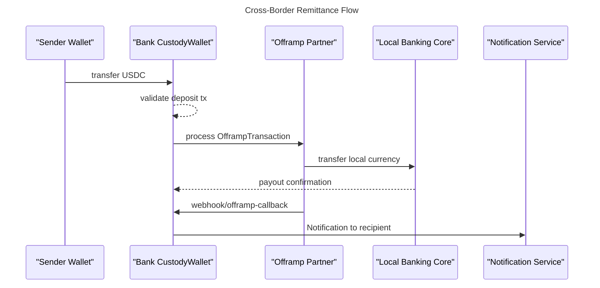

# Blockchain Cross-Border Remittance Platform

A modern, blockchain-based cross-border remittance solution designed for financial institutions seeking to offer instant, low-cost international money transfers. This platform bridges traditional banking infrastructure with blockchain technology to provide a seamless experience for retail users.

## Why Choose This Solution

### For Banks and Financial Institutions
- **Blockchain Integration**: Easily integrate with blockchain networks without specialized expertise
- **Low Implementation Cost**: Deploy and operate with minimal infrastructure changes
- **Regulatory Compliance**: Built with compliance considerations for financial institutions
- **White-label Ready**: Customize the platform with your brand and requirements

### For End Users
- **Instant Transfers**: Settle international transfers in minutes, not days
- **Low Fees**: Drastically reduce transfer costs compared to traditional SWIFT
- **Transparency**: Track transfers in real-time with full visibility
- **Familiar Interface**: Use regular banking apps with no crypto knowledge required

## Implementation Example

This repository shows a reference implementation with "Vikki Bank" as a sample institution. Any bank interested in becoming crypto-friendly can adapt this solution to their needs.

## Technical Overview

### User Flow (International to Local)

1. User sends USDC from external wallet to bank's custodial wallet
2. System validates the transaction (token type, amount, memo, KYC)
3. Off-ramp partner converts USDC to local currency (e.g., VND)
4. Local currency is transferred to recipient's bank account
5. User receives notification about the received funds

### Sequence Diagram



### System Architecture

The platform consists of the following components:

1. **API Layer**: REST endpoints for transaction management, webhook handling
2. **Blockchain Integration**: Solana integration with USDC token support
3. **Off-ramp Service**: Conversion from USDC to local currency
4. **KYC Verification**: Compliance checks for sender identification
5. **Notification System**: SMS/email notifications to recipients

### Background Jobs

| Queue          | Job                     | Purpose                                                                       |
|----------------|-------------------------|-------------------------------------------------------------------------------|
| `fx`           | `RefreshDailyRate`      | Update exchange rates                                                        |
| `transfer`     | `ValidateTransaction`   | Validate incoming blockchain transactions                                    |
| `transfer`     | `TriggerOffRamp`        | Initiate currency conversion process                                         |
| `transfer`     | `CheckKycStatus`        | Verify sender identity compliance                                            |
| `offramp`      | `ExecuteOfframp`        | Process off-ramp conversion with retry mechanism                             |
| `notify`       | `SendNotification`      | Send notifications to recipients                                             |

## Technology Stack

- **Backend**: NestJS (TypeScript)
- **Database**: PostgreSQL with Prisma ORM
- **Message Queue**: Redis with BullMQ
- **Blockchain**: Solana (USDC token)
- **Monitoring**: Prometheus + Grafana

## Getting Started

### Prerequisites

- Node.js 18+
- PostgreSQL/SQLite
- Redis
- Yarn or npm

### Installation

1. Clone the repository:
   ```bash
   git clone <repository-url>
   cd blockchain-cross-border-remit
   ```

2. Install dependencies:
   ```bash
   yarn install
   ```

3. Set up environment variables:
   ```bash
   cp .env.example .env
   # Edit .env with your configuration
   ```

4. Initialize the database:
   ```bash
   yarn prisma migrate dev
   ```

5. Start the development server:
   ```bash
   yarn start:dev
   ```

## Customization for Financial Institutions

This platform is designed to be customized for any financial institution:

1. **Banking Integration**: Adjust the local banking interfaces to match your core banking system
2. **Compliance Rules**: Modify KYC verification to match your regulatory requirements
3. **Currency Support**: Add support for your local currency and required exchange rates
4. **UI/UX**: Develop a frontend that matches your brand guidelines
5. **Off-ramp Partners**: Connect with local partners that can handle crypto-to-fiat conversion

## License

Proprietary - Copyright © 2025 - All rights reserved 